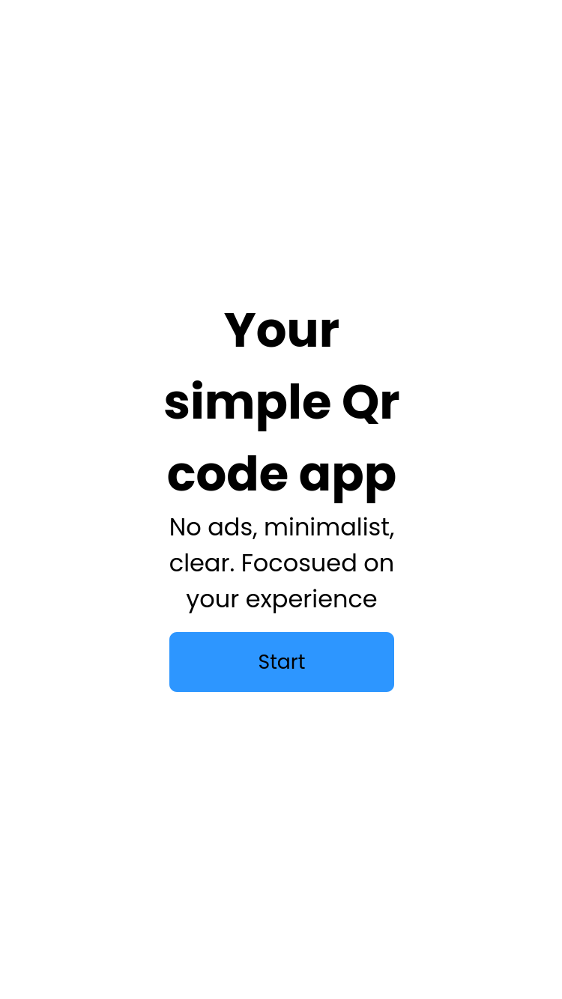
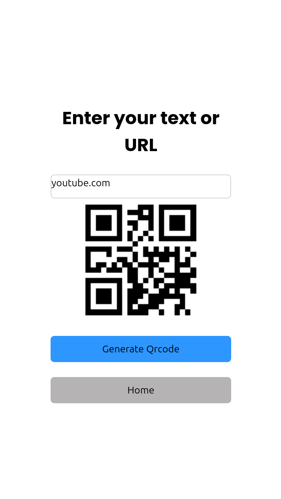

# Qr code app 

## Aesthetics:

* Minimalist and clean, following modern UI design principles.
  
* Rectangular input field, typically with subtle borders or soft shadows.
  
* Focus on readability: clear font, proper contrast with background.
  

* Simple visual feedback when typing (cursor, active field highlight).

## Application:

* Accepts text or URL to generate dynamic QR Codes.
  
* Usable in web and mobile applications for fast information sharing.
  
* Works together with the QR code generator, automatically encoding the input content.
  
* Supports multiple use cases: links, short messages, contact data, and more.

# Access the application link here: https://viktorcruz.github.io/Qrcode-app/

# Install (Privacy friendly)

* Local service, running entirely on your machine.

* In your machine, clone the repository using the following command: `git clone https://github.com/ViktorCruz/Qrcode-app.git`

* After cloning, go to the directory and run the command `live-server`.

* (If you don’t have live-server installed, you can install it using the following command:)

### update 

* `sudo apt update`

### install nodejs 
  
* `sudo apt install nodejs npm`

### Install live-server 

* `npm install -g live-server`

### running 

* `live-server`

* You should see something like ‘[http://127.0.0.1:8080/’.”](http://127.0.0.1:8080/’.”)

